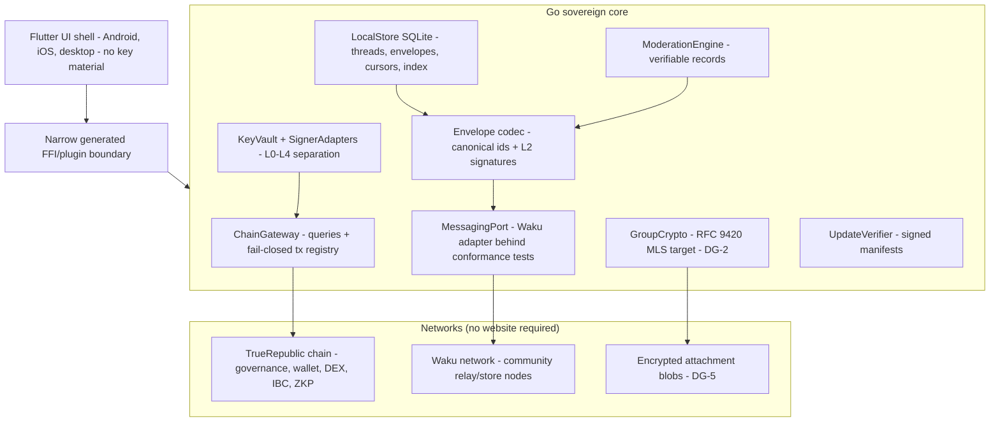
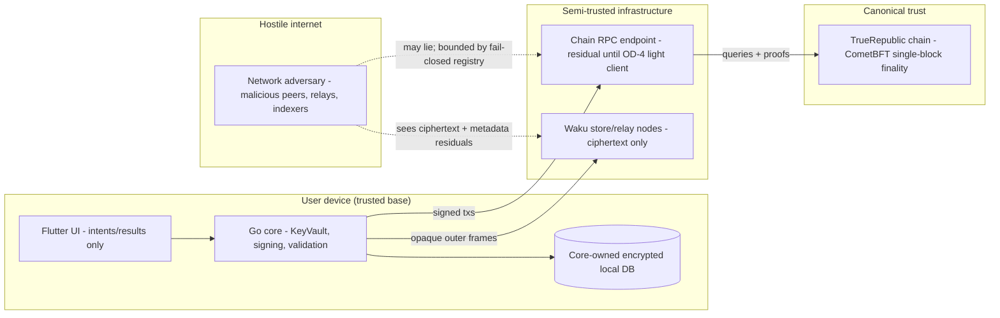
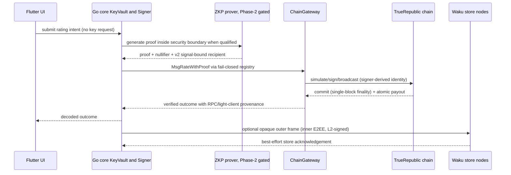

# Sovereign Alpha Architecture Proposal

> **Successor architecture:** GH-236's
> [Sovereign V4 Edge Architecture](SOVEREIGN_V4_EDGE_ARCHITECTURE.md) evolves
> this Alpha baseline with citizen nodes, mobile verification, civic workflows
> and sandboxed domain apps while retaining TRChain as the sole settlement
> chain. Both documents remain architecture-only.

**Issue:** [GH-215](https://github.com/NeaBouli/TrueRepublic/issues/215)
**Status:** Decision-ready proposal — documentation only. No product code,
dependency, protocol, consensus, cryptography, or wallet behavior is changed by
this document. **This document does not create an Alpha product, does not claim
production readiness, and does not select a production network.**

**Rollout accounting note:** This architecture block earns no rollout checkbox.
Published arithmetic is **1,959 recovery-verified tests** (1,614 Go +
26 Rust + 319 maintained client), **rollout 35/59**, phase work 35/51, and
**production false**, exactly as recorded in
[`docs/agent-bridge/PROJECT_STATE.md`](agent-bridge/PROJECT_STATE.md) and
[`docs/ROLLOUT_ROADMAP.md`](ROLLOUT_ROADMAP.md).

## Terminology (binding for this document)

- **Beta** — the current, maintained product: the `client-web` browser client
  (v0.4.0, recovery-verified) against the TrueRepublic chain. The Beta stays
  the supported client until the Alpha meets its acceptance gates. The word
  "Alpha" is never used to describe the current product.
- **Alpha** — the future target defined here: a sovereign, installable,
  Telegram-like TrueRepublic application for domain/group
  discussions, issues, suggestions, systemic-consensing ratings, stones,
  administration, and an integrated non-custodial PNYX wallet, implemented as a
  Flutter UI over a Go security core.
- **Exit sovereignty** — no mandatory single TrueRepublic-operated service is
  required for custody, messaging, governance, or normal operation. Bootstrap
  peers, RPC endpoints, store nodes, distribution channels, and OS push remain
  replaceable dependencies with availability and metadata risks. Website
  independence means operation and custody do not require a hosted website; it
  does not mean every first-install channel is infrastructure-free. Whether an
  optional web interface survives is deferred until the Alpha works (Section 16).

---

## 1. Executive summary and decision

**Decision (ADR-style, full summary in Section 14):**

1. **Build** an installable **Flutter/Dart UI shell** for Android, iOS, and
   desktop over a **Go sovereign core**, connected through a narrow generated
   FFI/plugin boundary. The core exclusively owns wallet and device secrets,
   group cryptography, envelope validation, encrypted storage, and chain
   signing. Adopt [Waku](https://docs.waku.org/) protocols over libp2p as the
   candidate transport, conditional on the A0 real-device qualification gate
   (DG-4). Exact toolchain versions and binding mechanics are spike-gated.
   The Beta's current fail-closed TypeScript transaction/signing and registered
   protobuf query behavior remains the target for golden compatibility vectors,
   not an Alpha runtime dependency. Retired or pre-GH-121 unregistered query
   aliases are explicitly excluded from the compatibility contract.
2. **Reject forking Telegram clients or building on TDLib.** Telegram's
   architecture is client-open/server-closed: cloud chats are stored on and
   routed by Telegram-operated servers under the MTProto client-server
   protocol. Forking a Telegram client yields a UI, not a network — the
   decentralized backend the Alpha requires does not exist on Telegram's side.
   Licensing (GPL-2.0/GPL-3.0 clients) adds copyleft obligations without
   solving the trust mismatch. We adopt Telegram's *UX patterns* only.
3. **Reject Matrix as the Alpha messaging foundation.** Matrix is federated,
   not serverless: identity, history, and membership live on homeservers. This
   trust model, not licensing, is the primary rejection. The specification is
   Apache-2.0; current Element-maintained Synapse and related future development
   use AGPLv3/commercial licensing. Matrix is a fallback only if Waku fails A0
   (OD-2), with its homeserver dependency accepted explicitly.
4. **Preserve `client-web` as the Beta** through all Alpha phases; the Alpha
   ships in parallel, never by mutating the Beta's trust model mid-flight.
5. **Gate third-party adoption on a project license (DG-3).** Although
   `CONTRIBUTING.md` says Apache 2.0, the repository currently has no
   discoverable root `LICENSE`. No third-party code or dependency is copied or
   linked until the owner publishes the project license and a per-component
   compatibility review passes. This proposal does not choose that license.

Everything in this document is a proposal for future issues. Every item that
cannot be verified from repository evidence or primary upstream sources is
marked as a **decision gate (DG-n)** or **open decision (OD-n)** rather than
asserted.

---

## 2. Current-state audit (repository evidence)

This audit cites exact repository evidence and states limitations plainly.

### 2.1 Chain and modules

- **Governance module** `x/truedemocracy` implements domains, issues,
  suggestions, stones, elections, lifecycle zones, admin election, member
  exclusion, onboarding, and anonymous rating. Evidence: `x/truedemocracy/`
  (`keeper.go`, `msgs.go` with 26 `sdk.Msg` implementations, `stones.go`, `lifecycle.go`,
  `governance.go`, `anonymity.go`, `big_purge.go`).
- **Identity comes from verified signers**, not caller-supplied strings:
  `x/truedemocracy/signing.go` wires hand-written message types into the `x/tx`
  signer-resolution contract so every message's signer is derived from its
  authenticated signer field (e.g. `MsgCreateDomain.GetSigners()` returns
  `m.Admin`, `msgs.go:27`). The Alpha must preserve this property end to end.
- **Tokenomics and custody**: `treasury/keeper/rewards.go` implements equations
  1–5; `token/issuance.go` enforces the 21,000,000 PNYX cap; DEX custody and
  canonical burns are recovery-verified (README "Implemented Features" table).
- **Anonymous voting (ZKP)**: Groth16/BN254 via gnark. Boundaries that
  constrain the Alpha wallet and UI directly:
  - GH-198/GH-203 freeze a **test-only** circuit/encoding contract
    (`configs/security/zkp-circuit.json`); committed proving/verifying keys are
    randomized single-party toxic-waste fixtures, not ceremony output.
  - GH-206 proves real but **synthetic, test-only** Go/WASM proof
    compatibility; the prover has no wallet/RPC/broadcast capability and
    `isSubmittable` remains hard false (`docs/LIMITATIONS.md`, "ZKP Client").
  - GH-209 binds a canonical bech32 reward recipient into the domain-separated
    `TrueRepublic/vote/v2` signal with atomic treasury payout; the module
    consensus version is 2 and v1 payloads fail closed. **Limitation:** direct
    payout publicly links the vote/nullifier event to the payout address.
  - Production ceremony, audited submission, and independent
    cryptographic/privacy review remain open (ROLLOUT_ROADMAP Phase 2).

### 2.2 Beta client (`client-web`)

- Stack: React 18 + TypeScript 5.9 + Vite 8.2 + CosmJS 0.39 + Zustand
  (`client-web/README.md`). 319 recovery-verified client tests.
- **Wallet**: BIP-39 (12/24 words), AES-GCM-256 with PBKDF2-HMAC-SHA-256 at
  600,000 iterations, encrypted payloads in browser `localStorage`
  (`client-web/src/services/wallet.ts:15-17,289,368-472`). GH-193 verifies
  bounded import errors, versioned storage with legacy re-encryption, exact
  derived-address/RPC-chain binding, and session-bound signer invalidation.
  **Limitation (stated in LIMITATIONS.md):** browser localStorage is exposed
  to a compromised same-origin runtime; hardware custody, real keys/funds, and
  production wallet operation are unqualified.
- **Transaction boundary**: one fail-closed registry
  (`client-web/src/services/txRegistry.ts`, 948 lines) plus a centralized
  simulate/sign/broadcast boundary (`client-web/src/services/signingClient.ts`).
  Exactly 8 `truedemocracy`, 3 `dex`, and the canonical ICS-20 `MsgTransfer`
  custom message identities are supported; unknown or legacy type URLs are
  rejected before signing (GH-115/GH-190).
- **Query transport**: registered protobuf gRPC-over-ABCI queries only
  (GH-121); unavailable data is rejected, never silently empty.
- **Limitation — hosting dependence**: the production container serves the app
  from nginx and proxies `/rpc` and `/api` to a loopback node
  (`client-web/README.md`, "Chain Configuration"; `nginx/nginx.conf`).
  Software availability and updates depend on a hosted website and app-store-
  free web distribution; there is no installable, self-updating artifact.
- **Limitation — RPC trust**: the configured RPC provider is trusted for
  completeness until a light client exists; this is an explicit residual in
  `docs/security/THREAT_MODEL.md`, not a control.
- **No messaging exists anywhere in the repository.** There is no chat,
  discussion, attachment, notification, or presence subsystem on chain or in
  the client. Discussions today happen outside the product (e.g. the project
  Telegram group linked in `README.md`).
- **Role in the Alpha:** the Beta's current fail-closed transaction/signing,
  registered protobuf query, and wallet behavior becomes golden compatibility
  evidence for the Go core. Retired/pre-GH-121 unregistered query aliases and
  any historical fail-soft behavior are excluded. TypeScript is not an Alpha
  runtime dependency.

### 2.3 Retired and absent surfaces

- `web-wallet` retired and removed under GH-112; `mobile-wallet` (React
  Native/Expo prototype) retired and removed under GH-102 after failing to
  produce an Android bundle, handling a mnemonic in UI memory, and carrying
  high/critical dependency exposure. **There is currently no supported native
  mobile client** (`docs/LIMITATIONS.md`). The Alpha must not resurrect the
  retired code; it starts from the audited `client-web` service layer
  patterns, not from the retired prototype. The Flutter/Go Alpha is a fresh
  implementation, not a revival of that React Native prototype.

### 2.4 What the audit implies

- Governance/economic state is already on-chain, deterministic, and
  signer-authenticated — the Alpha does not need to reinvent it.
- The gaps are exactly: decentralized messaging/storage/sync, installable
  distribution without a website, mobile-grade key custody, and a light-client
  story for RPC trust. These are the Alpha's scope.

---

## 3. Telegram evaluation (explicitly not a decentralization answer)

### 3.1 What Telegram actually offers

| Component | Upstream source | License | What it is |
|---|---|---|---|
| Telegram Android | [DrKLO/Telegram](https://github.com/DrKLO/Telegram) | GPL-2.0 | Full Android client (Java/C++) |
| Telegram iOS | [TelegramMessenger/Telegram-iOS](https://github.com/TelegramMessenger/Telegram-iOS) | GPL-2.0 | Full iOS client (Swift) |
| Telegram Desktop | [telegramdesktop/tdesktop](https://github.com/telegramdesktop/tdesktop) | GPL-3.0 | Desktop client (C++/Qt) |
| TDLib | [tdlib/td](https://github.com/tdlib/td) | [Boost Software License 1.0](https://github.com/tdlib/td/blob/master/LICENSE_1_0.txt) | Cross-platform client library: MTProto transport, local DB, sync — **talks only to Telegram's servers** |
| MTProto protocol | [core.telegram.org/mtproto](https://core.telegram.org/mtproto) | documented | Client↔server protocol |
| Telegram server | — | **closed source** | Routing, storage, accounts, groups, contacts, cloud sync |

### 3.2 Trust and decentralization mismatch

Telegram is **not decentralized**, and we must not claim otherwise:

- **Server-side custody of content.** Telegram's own FAQ describes cloud chats
  as stored on Telegram's servers with client-server encryption; end-to-end
  encryption exists only in optional device-bound "secret chats" that do not
  sync across devices ([telegram.org FAQ](https://telegram.org/faq)). Group
  chats — the Alpha's core surface — are never end-to-end encrypted on
  Telegram.
- **Single-operator control.** Accounts, phone-number identity, message
  routing, group administration, and availability are all controlled by one
  company running closed-source servers. There is no federation, no
  community-run server option for the official network, and no on-chain or
  user-held identity anchor.
- **TDLib is a client library, not a network.** Building on TDLib means
  Telegram FZ-LLC operates our identity, storage, and delivery. That fails the
  sovereignty requirement on every axis: identity, custody, messaging, and
  availability.

### 3.3 Licensing implications

- TDLib's Boost license is permissive and unproblematic in isolation, but it
  buys access to a centralized service we reject.
- The full clients are GPL-2.0 (Android/iOS) and GPL-3.0 (Desktop). Forking
  them would oblige derivative-work source disclosure, is a poor fit for any
  future app-store distribution (GPL-2.0/Apple App Store incompatibility is a
  long-standing upstream concern — mark as DG-1 if ever revisited), and —
  decisively — still leaves us without a sovereign backend.

### 3.4 Verdict

**Reject Telegram/TDLib as implementation inputs.** Adopt only its proven UX
vocabulary: chat list → domain spaces → threaded discussions, replies,
mentions, attachments, typing-free async design, and fast local-first sync.
The Alpha's familiarity target is Telegram's *interface*, not its
*architecture*. No Telegram code or assets are copied (DG-3).

---

## 4. Messaging foundation comparison

Candidates evaluated: **Waku**, **raw libp2p**, **Matrix**, and **SimpleX
Chat** (briefly, as a justified fourth). Criteria: mobile viability, offline
store-and-forward, group encryption, metadata/privacy, spam/Sybil resistance,
moderation fit, licensing, operational dependence, ecosystem maturity, and
integration burden.

### 4.1 Comparison table

| Criterion | Waku (over libp2p) | Raw libp2p | Matrix | SimpleX Chat |
|---|---|---|---|---|
| Model | Decentralized p2p pub/sub + store nodes; light-node protocols for phones ([protocols](https://docs.waku.org/learn/concepts/protocols)) | General p2p networking library ([libp2p specs](https://github.com/libp2p/specs)) | Federated homeservers ([spec](https://spec.matrix.org/)) | Serverless via disposable relay queues ([simplex.chat](https://simplex.chat/)) |
| Mobile viability | Designed for it: lightpush/filter for constrained nodes; [go-waku mobile bindings](https://github.com/waku-org/go-waku); production reference in [Status](https://github.com/status-im/status-mobile) | DIY: no light-node story out of the box; battery/NAT traversal is our problem | Proven, but requires a homeserver account | Proven mobile apps, but small group UX weak |
| Offline store-and-forward | `store` protocol + store nodes, with **no availability guarantee** ([13/WAKU2-STORE](https://rfc.vac.dev/spec/13/)) | None built in; must design mailbox layer | Homeserver stores history natively | Relays hold messages until delivery |
| Group encryption | Transport-agnostic; app owns E2EE; [RFC 9420 MLS](https://www.rfc-editor.org/rfc/rfc9420) is the target (DG-2) | Same: app-owned | Megolm built in | Built in (1:1/small groups; large groups immature) |
| Metadata/privacy | Sender anonymity goals; gossip + optional RLN; store nodes see ciphertext + topic metadata | No privacy guarantees by default; we build it | Homeserver sees social graph of its users; federation leaks room membership | Strong: no user identifiers; weak group scaling |
| Spam/Sybil resistance | RLN is available for evaluation ([security features](https://docs.waku.org/learn/security-features)); client membership checks do not prevent malicious relay writes, so network-level control remains DG-8 | None; we build it | Server-side policy + federation blocklists | Per-contact queues; spam model mismatches open domain groups |
| Moderation | App-level: verifiable moderation records (Section 9) fit cleanly | Same | Room admin/moderation native (power levels) | Minimal |
| Licensing | Component-specific; reuse is blocked until DG-3 | Component-specific; reuse is blocked until DG-3 | Spec Apache-2.0; current Element-maintained Synapse/future development AGPLv3/commercial ([Element, Dec 2023](https://element.io/blog/element-to-adopt-agplv3/)) | AGPL-3.0 |
| Operational dependence | Multiple community-operable relay/store nodes; bootstrap/RPC/store choices remain replaceable dependencies | Whatever we run ourselves | Each community needs a homeserver (hosting, identity, uptime) — reintroduces operator dependency | Public relay fleet plus optional self-host |
| Ecosystem maturity | Used in production by Status; specs versioned (RFC index); smaller ecosystem than Matrix | Large, multi-language, production-proven as plumbing (IPFS, Filecoin, Ethereum consensus clients) | Largest and most mature of the four; corporate/government deployments | Niche, focused on 1:1 privacy |
| Integration burden | Medium: js/Go implementations, defined wire specs; we own envelope/E2EE/moderation | High: everything above the transport is ours | Low protocol work, but we would embed a server per community and inherit AGPL stack + homeserver UX | High for group/domain model mismatch |

### 4.2 Reading of the table

- **Raw libp2p** maximizes control but hands us Waku's entire roadmap (light
  nodes, store-and-forward, spam resistance) as in-house work. That is exactly
  the kind of premature self-hosting of hard problems this project cannot
  staff.
- **Matrix** is the strongest *product* but fails the sovereignty requirement
  structurally: identity and history live on homeservers, so "no hosted
  service required" becomes "every domain operates or rents a homeserver."
  It remains the documented fallback (OD-2); license
  compatibility would still have to pass DG-3.
- **SimpleX** has the best metadata story but a group model (small, admin-
  mediated) that mismatches open domain-scale discussions with on-chain
  membership and moderation.
- **Waku** best fits the no-mandatory-community-server goal and is engineered
  for constrained mobile nodes. [Status specifications](https://specs.status.im/)
  and its open app show the messenger/community/wallet pattern on Waku, but
  TrueRepublic will not fork Status or import its Ethereum-specific backend.
  Waku adoption stays conditional on A0 real-device, lifecycle, resource,
  license/SBOM, and deterministic-build evidence.

---

## 5. Decision: build on Waku, own the application layer

**Build/adopt/reject, explicitly:**

- **Adopt conditionally** Waku protocols (`relay`, `lightpush`, `filter`,
  `store`) through a narrow Go `MessagingPort`, only after A0/DG-4 qualifies
  [go-waku](https://github.com/waku-org/go-waku) on real devices.
- **Build** a native-compiled [Flutter](https://docs.flutter.dev/resources/architectural-overview)
  UI over a Go core using official [Go mobile tooling](https://go.dev/wiki/Mobile).
  The generated/FFI API contains intents and results, never key export methods.
- **Build** on top: the TrueRepublic envelope format, domain topic scheme,
  end-to-end group encryption, moderation records, chain anchoring, indexing,
  and all key management. The transport never sees plaintext, identities, or
  governance semantics.
- **Use** Beta TypeScript behavior and vectors as compatibility oracles; do not
  link the TypeScript runtime into Alpha.
- **Reject** Telegram/TDLib and Status forks, raw libp2p as the deliverable
  foundation (integration burden), Matrix as primary (homeserver dependence +
  AGPLv3 server stack), and SimpleX (group-model mismatch).

**Why this is the right risk posture:** the Alpha's differentiating value —
on-chain-anchored identity, governance-grade moderation, wallet integration —
lives entirely in the layer we build. The transport is commodity plumbing we
can swap if Waku fails its gates; the interface boundary makes the swap a
contained change rather than a rewrite (OD-2 fallback: Matrix homeserver-per-
deployment behind the same port, accepting its sovereignty downgrade as an
explicit product decision, not an accident).

**Native transport gate (DG-4):** A0 must qualify go-waku mobile bindings,
Android/iOS lifecycle behavior, lightpush/filter/store correctness, battery,
bandwidth, binary size, licenses/SBOM, and reproducible artifacts. Exact
Flutter/Go versions and binding generation are fixed only by this evidence.

---

## 6. Target component model

```text
┌──────────────────────── Alpha UI (Flutter/Dart, installable) ─────────────────────┐
│ Android · iOS · desktop: chat UX, governance, ratings, stones, wallet, admin      │
│ Decoded intents/results only; no persistent mnemonic or raw private key material  │
└────────────────────────────────────────┬──────────────────────────────────────────┘
                                         │ narrow generated/FFI plugin
┌────────────────────────────────────────▼──────────────────────────────────────────┐
│                              sovereign-core/ (Go)                                │
│ KeyVault + signing │ envelope validation │ RFC 9420 MLS target (DG-2)             │
│ encrypted LocalStore │ ChainGateway │ MessagingPort │ moderation │ update verify  │
└────────────────────────────────────────┬──────────────────────────────────────────┘
                                         │
            ┌────────────────────────────┼─────────────────────────────┐
            ▼                            ▼                             ▼
   TrueRepublic chain           Waku network                    Attachment blobs
   (RPC/light client:           (community relay/               (content-addressed,
    governance, wallet,         store nodes; lightpush/         encrypted chunks on
    DEX, IBC, ZKP votes)        filter from mobile)             store nodes / IPFS-class
                                                                pinning — DG-5)
```

Component responsibilities:

- **Flutter UI shell.** Native-compiled Android, iOS, and desktop UI; no browser
  or WebView in the security path. It renders decoded state and submits typed
  user intents. Raw keys, mnemonic material, and live group secrets never cross
  the core boundary.
- **Go sovereign core.** Owns all security-critical state and operations:
  wallet/device/group keys, signing, canonical envelopes, encrypted local
  storage, chain access, messaging, moderation, and update verification. The
  absence of key-export methods enforces the FFI boundary fail-closed.
- **UI.** Telegram-like: domain list → spaces (issues) → threaded discussion;
  rating/stones controls attached to suggestion objects; admin panel; wallet
  tab. Governance screens render chain state, never local guesses.
- **ChainGateway.** All chain access behind one interface: registered
  protobuf queries (GH-121 boundary), fail-closed tx registry (GH-115
  pattern), and a light-client verification track (OD-4: CometBFT light
  client in TS — e.g. evaluating existing light-client implementations — is a
  gate, not an assumption). Until light verification lands, RPC trust remains
  a declared residual, exactly as in the Beta threat model.
- **RPC/peer discovery.** Chain RPC endpoints are user-configurable with
  pinned defaults shipped per release; Waku peers are discovered via the
  transport's discovery mechanisms (DNS discovery / peer exchange per Waku
  specs), with a repository-pinned bootstrap list treated as untrusted input.
- **Messaging/relay/store.** Community-operated Waku store/relay nodes hold
  only ciphertext with TTL; mobile clients use lightpush/filter. Anyone can
  run a store node; loss of all store nodes degrades history sync, never
  identity, wallet, or governance.
- **Encrypted attachments.** Client-side chunked, encrypted, content-addressed
  blobs (hash in the envelope, key in the E2EE layer). Storage backend choice
  (Waku store with size caps vs. an IPFS-class pinning path) is DG-5; large
  blobs never go on-chain.
- **Local database.** Core-owned SQLite (SQLCipher-class encryption at rest — DG-6) with
  a versioned schema; per-domain materialized thread indexes; sync cursors per
  topic per store node. Query strategy: local-first — all UI reads hit the
  local index; chain reads are the authority for governance state and are
  reconciled into the index (Section 9.8).
- **Signer adapters.** Go software signer (GH-193 behavior reimplemented and
  verified against Beta golden vectors — never browser `localStorage`), hardware/
  external signer interface (Ledger-class, platform authenticators) behind an
  adapter so custody upgrades do not touch protocol code (OD-5).
- **Software update/distribution.** Signed release manifests verified in-app
  before install; builds extend the GH-212 pinned-toolchain/reproducible-
  evidence foundation to mobile targets; distribution via direct artifact
  download, F-Droid-class repositories, and platform stores as replaceable
  channels. iOS distribution remains policy/jurisdiction constrained (OD-6),
  so this document does not claim app stores are never needed for first install.
  Each manifest binds target platform, channel, semantic version, monotonic
  build number, minimum supported build, artifact digest and prior-manifest
  digest. `UpdateVerifier` stores the highest accepted build per target/channel
  in core-protected state and rejects replay/downgrade or cross-channel/target
  substitution. An emergency downgrade requires a separately typed, bounded,
  expiring rollback authorization under the future release-signing policy; an
  ordinary signed manifest can never lower the floor.
- **Optional web boundary.** Out of Alpha scope; see Section 16.

---

## 7. Key and identity model (strict separation)

Design rule inherited from the repository: identity derives from verified
signers/proofs, never from caller-supplied address strings
(`x/truedemocracy/signing.go`; COOPERATION_RULES). No cryptographic guarantee
below is asserted beyond what the cited primitives provide; exact schemes are
settled in implementation issues with test vectors.

| Layer | Key | Purpose | Storage/custody | Rotation & revocation |
|---|---|---|---|---|
| L0 | **Recovery credential** (BIP-39 mnemonic) | Root of the account hierarchy | User-held, offline; entered only on setup/recovery | Rotates only by full account migration to a new mnemonic |
| L1 | **Chain account key** (secp256k1, m/44'/118' Cosmos path, `truerepublic` bech32) | Wallet transactions, governance txs, device enrollment authorization | Encrypted in device vault; hardware-signer adaptable | On-chain account-change is not supported by Cosmos accounts → rotation = new account + on-chain membership re-grant flow |
| L2 | **Device identity key** (Ed25519, per device) | Signs message envelopes, device enrollment, moderation actions | Device vault, enrolled by an L1 signature | Revoked by an L1-signed revocation record propagated to the domain; revocations are honored by clients and honest store nodes |
| L3 | **Domain group encryption state** (target: an audited RFC 9420 MLS implementation selected under DG-2; custom crypto and ad-hoc shared sender keys are rejected) | E2EE of discussion content and attachments | Core-owned per-device state; never touches the chain | Membership changes advance the epoch; forward-secrecy/post-compromise properties are not claimed until DG-2 and independent review pass |
| L4 | **Anonymous governance identity** (ZKP identity secret → identity commitment, existing `x/truedemocracy` anonymity model) | Unlinkable systemic-consensing ratings | Device vault, **separate from and never linkably derived from L1** | Reset by the existing on-chain Big Purge mechanism (90-day anonymity-set refresh) |
| L5 | **Validator/operator keys** (CometBFT Ed25519 consensus key + operator authority) | Consensus participation and node operation | **Never in the Alpha app.** Operator custody per GH-55/GH-56 | Existing rotation/revocation paths only |

**Multi-device control:** a new device generates L2. L1 signs a canonical
control record `{account, control_seq, prev_control_hash, action, device_pubkey,
capabilities}`. Sequence begins at 1 and advances by exactly one. Records with a
sequence of 1 use a fixed 32-byte all-zero predecessor; all later records use
the exact canonical hash of the winning prior record. Records with a gap,
replayed sequence, or wrong predecessor remain quarantined until missing state
arrives; they never authorize a device speculatively. For competing valid
records at the same sequence, revocation of the affected device wins, then the
lexicographically smallest canonical record hash breaks any remaining tie.
Every later record must extend that deterministic winner, so different arrival
orders converge. Group state reaches a newly enrolled device only through the
qualified MLS member-add path or an established device-to-device channel.

**Revocation:** the winning L1-signed revocation tombstones L2 and advances both
the account control epoch and affected domain MLS epochs. Once a client observes
that update it rejects every not-yet-accepted envelope carrying an earlier
control or group epoch, including honestly delayed envelopes; safety is chosen
over delayed delivery. A revoked device retains only history it already holds —
no retroactive secrecy is claimed. Relays are not trusted to enforce revocation.

**Recovery:** BIP-39 L0 recovery restores the chain account L1 and its ability
to re-enroll devices. It does **not** restore old L3 chat epochs. Chat history
recovery requires an encrypted user-held backup with an independently protected
key (DG-6/OD-8), or transfer from a still-enrolled device. Without either, old
chat history is unrecoverable; rejoining after exclusion does not restore keys
for the excluded period. L4 and L3 secrets are never linkably derived from the
public chain identity, so losing their separate backup may lose them as well.

**Hardware/external signers:** L1 operations route through `SignerAdapter`;
hardware custody upgrades the wallet without touching messaging or identity
code. No hardware wallet integration exists today in the repository — this is
new, gated work (OD-5).

---

## 8. On-chain vs off-chain responsibility map

**Rule: the blockchain is canonical for governance and economic state; large
or high-volume chat content never goes on-chain.** Chain state is what every
client must agree on; everything else is off-chain ciphertext with on-chain
anchors where governance needs them.

| Concept | On-chain (canonical) | Off-chain (Alpha messaging) |
|---|---|---|
| Domains | Creation, parameters, treasury (`MsgCreateDomain`, escrow) | Domain profile text, avatar, welcome content; any chain hash anchor requires a separate future consensus proposal |
| Domain policy | No retention/TTL/topic fields exist in the current protocol | Versioned policy signed by an authority verified against current on-chain admin state |
| Membership | Join/approve/exclude (`MsgOnboardToDomain`, `MsgApproveOnboarding`, `MsgAddMember`, exclusion votes) | Member display names, presence, delivery state |
| Roles/admin | Admin election, role state (`governance.go`) | Admin *actions in chat* (pin/hide) as signed records verified against on-chain role at chain height |
| Discussions (chat) | **Nothing.** Not stored on-chain. | All message envelopes, threads, attachments |
| Issues | Issue objects, lifecycle | Issue discussion threads (envelope topic per issue) |
| Suggestions | Submission, lifecycle zones, auto-delete (`MsgSubmitProposal`, `lifecycle.go`) | Suggestion body long-form + discussion; on-chain stores the canonical object |
| Systemic-consensing ratings | Ratings, nullifiers, reward payout (GH-209 v2 binding) | Rating *debate*; pre-rating sentiment is chat, not votes |
| Formal ballots (future GH-232) | Proposed immutable policy/electorate snapshots, ballot lifecycle, tally and result under [GH-231](GOVERNANCE_BALLOT_ARCHITECTURE.md); not implemented | Deliberation, candidate profiles and notifications only; chat never determines the canonical result |
| Stones | Stone placement (`MsgPlaceStoneOnIssue/Suggestion`) | Stone rationale discussion |
| VoteToEarn | Reward accounting and payout (treasury equations) | Nothing |
| ZKP votes | Proof verification, nullifiers, VK state (fail-closed until Phase 2 gates) | Proof generation happens client-side; no messaging role |
| Moderation | Exclusion (2/3 vote), admin status | Hide/delete-request records signed by L2 keys of on-chain-verified admins; enforcement is client-side filtering + honest-relay cooperation (Section 9.7) |
| Attachments | Optional content-hash anchor only | Encrypted blob storage (DG-5) |
| Notifications | Chain events consumed via ChainGateway subscriptions | Local/in-app by default; timely background delivery is not guaranteed without OS push. Optional opaque push gateways add metadata/availability tradeoffs (OD-7) |
| PNYX/IBC/DEX | All transactions (bank, `x/dex`, ICS-20 per GH-190 boundary) | Order discussion, market chatter |

---

## 9. Message architecture (protocol level)

### 9.1 Envelope

```text
Outer Waku frame (relay/store-visible):
  version, ttl, content_topic, opaque_payload
  Private domains use epoch-scoped unguessable topic capabilities (DG-7).
  No plaintext account, device, domain, moderation, or causal identifier is
  placed in the frame; content-topic, size, timing and network metadata remain
  observable and may permit domain-to-topic correlation.

Inner envelope v1 (canonical protobuf; group-encrypted and L2-signed):
  version, chain_id (domain separation; pinned at signing time)
  envelope_id = SHA-256(canonical bytes excluding envelope_id and signature)
  topic_binding = SHA-256(canonical outer content_topic bytes)
  domain_id, topic_class (discussion | control | moderation | attachment_manifest)
  author_account (bech32, proven — see 9.2), author_device_id (L2 pubkey hash)
  account_control_seq, account_control_hash, domain_group_epoch
  lamport_clock, parent_refs[] (causal parents; last-seen envelope ids)
  authorization_block {height, block_hash} (latest final state observed at signing)
  content_type, content, content_size
  attachment_refs[] {content_hash, chunk_count, total_size, key_id}
  schema extensions
  signature (L2 Ed25519 over all other canonical inner fields, including topic_binding)
```

### 9.2 Authentication

Every inner envelope's `author_account` is proven, not asserted: the envelope (or
its device enrollment chain) carries an L2 signature plus the L1-signed
enrollment record binding L2→L1. Clients verify the chain of signatures
locally. Before processing they require the outer topic to hash exactly to the
signed `topic_binding`, the latest converged account-control record to authorize
L2 at the signed sequence/hash, the message's group epoch to equal the current
accepted domain epoch, and membership/role authorization at least as recent as
`authorization_block`. A caller cannot select an older valid height to bypass a
later observed revocation: once newer final chain or control state is known, any
not-yet-accepted earlier-epoch envelope fails closed. The sender's claimed block
is a lower bound/checkpoint, not proof of wall-clock issuance; until OD-4, a
malicious RPC can still delay or lie about newer state, which remains explicit.
Caller-supplied addresses without proof are rejected — the Alpha inherits the
repository rule that identity comes from verified signers. The outer frame
contains none of these fields in plaintext.

### 9.3 Encryption policy

- Discussion content: RFC 9420 MLS is the target; no private-domain
  confidentiality is claimed until DG-2 selects, tests, benchmarks, and
  independently reviews an implementation. Relays see only the outer frame.
- Control and moderation records: signed and group-encrypted for members.
- Public domains may publish an explicit public topic policy. Private domains
  use epoch-scoped unguessable topic capabilities (DG-7). Neither provides
  perfect network-metadata privacy.
- DMs/1:1: out of Alpha v1 scope (non-goal NG-4); the envelope format reserves
  the topic class.

### 9.4 Ordering and conflict

Causal order via `parent_refs` + Lamport clocks; wall-clock timestamps are
display hints only and never ordering authority. Governance-visible state
(suggestions, ratings, stones) is ordered by the chain, not by chat order —
chat about a suggestion can be eventually consistent without affecting any
governance outcome.
Account-control records additionally follow the sequence/predecessor and
deny-wins/tie-break rules in Section 7; Lamport order alone never authorizes or
revokes a device.

### 9.5 Retention

Per-domain TTL classes live in a versioned off-chain policy signed by an
authority verified against current on-chain admin state. They are not current
chain settings. Store-node retention is best-effort; clients may keep local
history. No delivery or permanent archive is guaranteed, and any future
on-chain policy anchor requires a separate consensus proposal.

### 9.6 Offline sync

An offline sender queues locally and publishes through lightpush only after a
peer becomes reachable. Waku Store is best-effort retrieval, not an availability
guarantee: nodes can lose, drop, or never receive an envelope. Alpha therefore
queries multiple independent store peers, detects causal/cursor gaps, merges
idempotently by envelope id, and renders missing-history ranges honestly rather
than inventing continuity.

### 9.7 Deletion and moderation semantics

- **Delete-request**: author-signed tombstone; clients hide and purge local
  copies; honest store nodes drop the ciphertext. Cryptographic
  "un-distribution" is impossible — deletion is best-effort and stated as such.
- **Moderation action**: L2-signed record `{action: hide|pin|remove-request,
  target_envelope_id, authorization_block, account_control_seq,
  domain_group_epoch}`. Clients accept it only if the device is current and the
  account still holds the admin role in their latest observed final chain state;
  delayed actions from an earlier role/control epoch fail closed even if the
  author supplies a formerly valid height. A verifiable moderation log is rendered in the
  admin panel, so silent abuse is visible to all members. Content-level
  censorship by relays cannot delete what other relays/clients already hold;
  exclusion from the domain (on-chain) is the ultimate remedy and triggers an
  L3 key epoch change.
- **Domain-admin abuse** is mitigated by transparency (the log), by on-chain
  admin election/removal, and by the fact that chat moderation never touches
  wallet or governance state.

### 9.8 Chain reorg/finality handling

CometBFT provides single-block finality; there are no probabilistic reorgs
under its ⅔+ honesty assumption. The Alpha therefore treats committed chain
state as final, but: (a) equivocation/misbehavior evidence is still surfaced
to the user (slashing exists — `consensus_slashing.go`); (b) until the light
client lands (OD-4), a malicious RPC can lie about membership/roles/balances —
the declared residual — so moderation verification and wallet displays carry
an explicit "verified by: RPC endpoint X" provenance marker; (c) governed
upgrades (GH-184 path) may change module behavior — the core pins supported
module consensus versions and fails closed on unknown versions, mirroring the
chain's own v1→v2 fail-closed discipline.

---

## 10. Security and privacy threat model (Alpha additions)

Extends — never replaces — `docs/security/THREAT_MODEL.md` and
`configs/security/threat-model.json`, which remain the canonical register.
Each entry states mitigation and **residual risk honestly**.

| Threat | Mitigation (architecture level) | Residual risk |
|---|---|---|
| Malicious relays/store nodes | Ciphertext-only storage; signed `topic_binding` rejects cross-topic republishing; envelope signatures; multi-node redundancy; hash/dedup verification | Availability withholding and traffic analysis remain; topic/domain correlation is visible or inferable — padding/cover traffic/private derivation remain DG-7 |
| Metadata leakage | Inner-envelope E2EE; identity and domain metadata absent from private outer frames; no phone-number identity | IP/timing/size/topic traffic remains observable; no perfect metadata privacy is claimed |
| Spam/Sybil | Honest clients validate membership before rendering; client rate policy and moderation | A malicious publisher can still write to relays. Private write capabilities and/or ZK rate/membership credentials need DG-8; RLN evaluation is not PNYX integration |
| Replay | Envelope id dedup, causal parents, TTL; chain txs inherit CometBFT/account-sequence replay protection (GH-172 evidence class) | Cross-network replay between a testnet and a future network must be domain-separated at envelope signing time (pinned chain-id field — required in envelope v1) |
| Equivocation (author sends conflicting versions) | Causal DAG exposes forks; clients surface "conflicting edit" markers | No consensus over chat history; conflicting-display attacks remain possible in low-connectivity partitions — surfaced in UI, not hidden |
| Compromised device | Key separation, revocation, core-owned vault (DG-6) | A compromised device leaks decryptable history; no forward secrecy or post-compromise security is claimed before DG-2 and independent review |
| XSS / web supply chain | Alpha is native-compiled Flutter with no browser/WebView requirement in the trust path | An optional future web interface would restore the GH-193 same-origin residual |
| Update compromise | Signed release manifests, in-app verification, reproducible-build evidence extending GH-212, multi-source artifact comparison | Signing-key compromise and first-install trust (TOFU) remain; mitigated by published transparency of builds, not eliminated |
| Malicious RPC/indexer | Fail-closed query boundary (GH-121 pattern), provenance markers, light-client track (OD-4) | Until OD-4 lands, completeness/correctness of governance reads trusts the configured RPC — same declared residual as the Beta today |
| Wallet-drain prompts | The only supported Alpha signing path shows decoded, registry-validated content and rejects unknown type URLs (GH-115 pattern); no blind-sign method is exposed | A compromised client/core or deceptive known-message fields remain risks; independent review and human-readable intent checks reduce, not remove, them |
| Domain-admin abuse | Verifiable moderation log; on-chain admin election/removal; moderation power limited to chat surfaces | An admin can still censor chat locally for compliant clients before being voted out — transparency, not prevention |
| Censorship (network/state level) | p2p transport, multiple discovery paths, user-runnable store nodes | State-level blocking of the whole network family is out of scope for this document |
| Recovery abuse | Enrollment notifications to existing devices; L0 held offline; re-join does not restore excluded-period keys | Social-engineering recovery attacks remain; no guardian/social recovery is specified (OD-8) |
| Dependency/license risk | DG-3 project-license and per-component review; SBOM and pinned artifacts in A0 | Upstream licensing or supply-chain changes remain possible |
| Background delivery | Local notifications by default; optional opaque push gateway | Without Apple/Google push, timely background notifications may fail; with it, metadata/availability dependence returns |
| Replaceable infrastructure | Multiple bootstrap/RPC/store/distribution choices; no mandatory single TrueRepublic operator | Each dependency can still fail or leak metadata; exit sovereignty is not infrastructure-free operation |

---

## 11. Diagrams (GitHub-renderable Mermaid)

### 11.1 Component model



### 11.2 Trust boundaries



### 11.3 Critical data flow — anonymous rating end to end



---

## 12. Phased Beta→Alpha delivery slices

Each slice is independently testable and reversible: the Beta is untouched,
and every Alpha slice ships behind its own gates with rollback = "stop
shipping the slice; the Beta remains the supported client."

| Slice | Content | Acceptance gates | Coexistence/migration | Rollback |
|---|---|---|---|---|
| **A0 — Native transport qualification** | go-waku mobile bindings, lifecycle, store/lightpush/filter on real devices; battery/bandwidth/binary-size report; Flutter/Go/FFI qualification; license/SBOM and deterministic-build evidence | Real Android round trip plus background/reconnect matrix; explicit budgets; DG-3 resolved before dependency adoption | None (lab only) | Spike discarded; OD-2 fallback recorded |
| **A1 — Go core foundations** | Outer/inner codec, canonical ids, L2 identity, encrypted LocalStore, MessagingPort conformance; **no UI** | Property/fuzz tests; conformance against real Waku; enrollment/revocation flows | Parallel to Beta | Core versioned away |
| **A2 — Flutter chat slice** | Android-first Telegram-like discussion UI; group encryption only through the DG-2-qualified MLS path; attachments after DG-5 | Offline queue/reconnect/gap-honesty matrix; MLS interop/performance evidence; multi-device/moderation/accessibility tests | Invite-only disposable test environment | Pull build; Beta remains |
| **A3 — Wallet + governance integration** | Go ChainGateway checked against Beta golden vectors; core-owned wallet/vault; ratings/stones/suggestions; role-verified moderation | Wallet/signing adversarial suite; governance parity vs CLI and Beta vectors; RPC-lying/finality tests | Alpha and Beta share canonical chain state | Disable Alpha wallet; Beta unchanged |
| **A4 — Distribution + updates** | Target/channel-bound signed manifests, monotonic UpdateVerifier floor, reproducible mobile builds extending GH-212 evidence, F-Droid-class + direct download channels | Deterministic-build parity; replayed-old-build, downgrade, cross-target/channel, floor-loss and unauthorized-rollback negative tests; install-without-website walkthrough | Beta continues as the web path; no website is added to the Alpha trust path | Halt publication; installed builds keep working; emergency rollback uses separately authorized bounded metadata |
| **A5 — Hardening + iOS/desktop** | iOS lifecycle/distribution, desktop sequencing, hardware signer, DG-8 spam gate, independent security and MLS-integration review | Zero unresolved P0/P1; multi-platform conformance; recovery/revocation and missing-history drills | iOS channel decided per OD-6 | Platform slice deferred without touching Beta |
| **A6 — Alpha readiness review** | Full verification matrix (Section 13); data-portability export/import proof; Beta↔Alpha coexistence soak | All prior gates re-run on the release candidate; rollback drill executed; **explicit go/no-go recorded by project owner** | Beta remains available regardless of the decision | "No-go" leaves Beta as the sole supported client |

**Data portability:** local history export (encrypted archive, user-held key)
and chain-state portability is inherent (chain is canonical). **Rollback
rule:** no slice ever migrates Beta users or mutates Beta data; the worst-case
rollback is uninstalling the Alpha.

---

## 13. Verification strategy

- **Unit/property/fuzz:** envelope codec round-trip and canonical-id
  properties; ordering/dedup under adversarial Lamport/parent permutations;
  fuzzed envelope and attachment-manifest parsers (mirroring the GH-145
  generative-quality discipline).
- **Protocol conformance:** a Go transport-independent conformance suite every
  MessagingPort adapter must pass (publish, filter, store-query, TTL, cursor
  resume) — this is what makes the OD-2 fallback cheap.
- **Multi-device:** enrollment, revocation, mid-sync device addition, sequence/
  predecessor gaps, replay, concurrent enroll-vs-revoke, deterministic tie-break,
  different arrival orders, delayed old-epoch rejection and history-partiality
  tests on real device pairs.
- **Offline/replay/recovery:** airplane-mode send/receive matrices;
  store-node-loss and missing-history behavior; duplicate-envelope and
  cross-chain replay negatives; mnemonic recovery drills proving chain-account
  restoration does not falsely restore chat epochs.
- **MLS:** RFC 9420 interoperability vectors, large-group/mobile performance,
  membership-epoch, and independent cryptographic review gates.
- **Deterministic builds:** two-builder parity for Flutter/gomobile artifacts;
  extends the GH-212 pinned-toolchain and SBOM-parity evidence model to
  mobile; unsigned-evidence discipline retained until Phase 7 signing gates
  exist.
- **Updates:** target/channel/version/build/floor/digest binding; replayed older
  signed manifests, downgrade, cross-channel/target substitution, protected-
  state loss and unauthorized emergency rollback all fail closed.
- **Wallet/signing:** Beta behavior used as golden vectors for the Go core —
  fail-closed registry drift tests, in-flight signer invalidation after lock/
  switch/delete, exact chain-id binding, drain-prompt decoding tests.
- **UI accessibility:** screen-reader, dynamic-type, low-bandwidth, and
  responsive checks on all chat/governance/wallet flows (GH-132 discipline,
  native tooling).
- **Cross-platform:** Android/iOS/desktop core conformance; release order is OD-3.
- **Licenses/SBOM:** no dependency adoption before DG-3; A0 records the complete
  resolved SBOM and license-compatibility evidence.
- **Adversarial security:** malicious-relay topic substitution, malicious-RPC,
  delayed-after-revocation authorization, update compromise, and equivocation
  harnesses from Section 10, run as CI gates where
  deterministic and as scheduled process harnesses otherwise.
- **Independent reviews:** protocol/core review before A5 completion;
  cryptographic review of the DG-2 group-scheme choice; no production claim
  without them — consistent with the repository's evidence-class rules
  (THREAT_MODEL.md).

---

## 14. ADR summary, non-goals, open decisions, work breakdown

### 14.1 ADR-style decision summary

| # | Decision | Alternatives rejected | Status |
|---|---|---|---|
| ADR-1 | Flutter/Dart installable UI + Go sovereign core over a narrow generated FFI/plugin boundary | Shared TS/React Native runtime; extend client-web; revive GH-102 | Proposed (A0 toolchain-gated) |
| ADR-2 | Waku over go-waku behind MessagingPort | Raw libp2p; Matrix; SimpleX; Telegram/TDLib | Proposed, conditional on A0/DG-4 |
| ADR-3 | RFC 9420 MLS target for application-owned group E2EE; no custom crypto | Transport-owned encryption; ad-hoc sender keys | Proposed (DG-2) |
| ADR-4 | Chain canonical for governance/economics; chat off-chain; domain policy is signed off-chain today | On-chain chat; invented current chain policy fields | Proposed |
| ADR-5 | Key separation L0–L5 with device enrollment/revocation | Single-key model; per-message chain identity | Proposed |
| ADR-6 | Beta preserved; only current registered/fail-closed behavior is golden evidence, excluding retired/pre-GH-121 aliases; TS is not an Alpha runtime dependency | Big-bang replacement | Proposed |
| ADR-7 | Exit sovereignty: no mandatory single TrueRepublic-operated service; infrastructure remains replaceable, not nonexistent | Website-gated operation; decentralization absolutism | Proposed (OD-6/OD-7) |

### 14.2 Non-goals (NG)

- NG-1: No production network selection, mainnet claim, or real-funds
  readiness — `production_ready` stays false.
- NG-2: No changes to consensus, protocol, cryptography, token accounting, or
  the Beta wallet in this document's scope.
- NG-3: No Telegram fork, no TDLib dependency, no MTProto reuse.
- NG-4: 1:1 DMs, voice/video, and public broadcast channels are out of
  Alpha v1.
- NG-5: No on-chain chat storage or per-message on-chain anchoring.
- NG-6: No new cryptographic primitives or claimed forward-secrecy/post-
  compromise guarantees before DG-2 and independent review.
- NG-7: No decision on the optional web interface (Section 16).
- NG-8: No Status fork or import of its Ethereum-specific application/backend.

### 14.3 Open decisions (OD) and decision gates (DG)

- **OD-1** RFC 9420 MLS implementation/library owner and delivery timeline.
- **OD-2** Documented fallback if A0 fails: Matrix behind MessagingPort with
  sovereignty downgrade explicitly accepted by the product owner.
- **OD-3** Desktop shell: build/defer decision after A2.
- **OD-4** CometBFT light-client verification in the Alpha (library choice,
  mobile cost) — until then RPC trust remains a declared residual.
- **OD-5** Hardware/external signer integration scope and ordering.
- **OD-6** iOS distribution channel (App Store vs alternatives) — legal/
  platform review required.
- **OD-7** Push-notification privacy posture (default local notifications).
- **OD-8** Chat-history recovery: encrypted user-held backup and/or enrolled-
  device transfer; social/guardian recovery must be specified or rejected.
- **DG-1** GPL fork legal review (only if Telegram components are ever
  revisited — currently rejected).
- **DG-2** MLS implementation qualification: RFC 9420 interop vectors,
  large-group/mobile performance, and independent cryptographic review. No
  private-domain confidentiality/FS/PCS claim before it passes.
- **DG-3** Project-license gate: publish the root license, then complete a
  per-component compatibility review before copying or linking dependencies.
- **DG-4** A0 go-waku mobile binding, lifecycle, resource, SBOM/license, and
  reproducible-build qualification; exact Flutter/Go/FFI choices fixed here.
- **DG-5** Attachment blob backend (Waku-store-with-caps vs IPFS-class).
- **DG-6** Local database encryption-at-rest implementation choice.
- **DG-7** Topic metadata mitigation (private topic derivation/padding).
- **DG-8** Network-level spam gate: private write capabilities and/or ZK
  rate/membership credentials. RLN evaluation is not PNYX integration.

### 14.4 Implementation work breakdown (future GitHub issues, proposal)

1. `GH-2xx` A0 go-waku/Flutter/Go/FFI qualification and conformance harness.
2. Owner action: resolve DG-3 root license and compatibility review.
3. `GH-2xx` Outer/inner envelope codec + property/fuzz suite.
4. `GH-2xx` Go KeyVault and L0–L4 separation with enrollment/revocation.
5. `GH-2xx` Versioned generated FFI/plugin boundary with no key-export API.
6. `GH-2xx` MessagingPort + go-waku adapter + multi-peer store guide.
7. `GH-2xx` Core-owned encrypted LocalStore, index, cursors, gap detection.
8. `GH-2xx` MLS qualification (DG-2), then GroupCrypto integration.
9. `GH-2xx` Flutter chat slice (A2) with offline/gap-honesty tests.
10. `GH-2xx` Go ChainGateway checked against current registered/fail-closed Beta
    vectors, explicitly excluding retired/pre-GH-121 aliases.
11. `GH-2xx` Native wallet slice with signer adapters (A3).
12. `GH-2xx` Moderation engine + verifiable moderation log UI.
13. `GH-2xx` Signed, chain-authority-verified domain policy record.
14. `GH-2xx` Attachment pipeline (post-DG-5) with encrypted chunking.
15. `GH-2xx` Network spam-control protocol evaluation (DG-8).
16. `GH-2xx` Update/distribution slice (A4): signed manifests, reproducible
    mobile builds, F-Droid-class channel.
17. `GH-2xx` Threat-model register extension for Alpha.
18. `GH-2xx` Independent security and cryptographic review (A5).
19. `GH-2xx` Alpha readiness review + rollback drill (A6).
20. [GH-232](https://github.com/NeaBouli/TrueRepublic/issues/232) chain-side
    optional ballot engine; Alpha consumes only its versioned, fail-closed
    transaction/query contract after rollout stabilization and all applicable
    consensus, production-ZKP, privacy and legal/process gates.

---

## 15. Honest status statement

This document proposes an architecture. It does **not** imply that any Alpha
code, native app, production network, ceremony, security audit, or real key/
fund handling exists. It does not change the recovery-track status: rollout
**35/59**, phase work 35/51, production **false**, test arithmetic **1,959**
unchanged. Every external claim herein is either cited to primary upstream
sources (Sections 3–4) or marked as a decision gate/open decision. The Beta —
`client-web` — remains the only supported client.
Waku adoption is conditional on A0, confidentiality/FS/PCS are conditional on
DG-2, and no third-party code is adopted before DG-3.

---

## 16. Deferred: the optional web interface

Whether any web interface survives the Alpha is **explicitly deferred** until
the Alpha works. The deciding inputs when that question opens: (a) the GH-193
same-origin residual — a browser wallet can never reach the Alpha's native
custody bar; (b) maintenance cost of two governance front ends; (c) whether a
read-only, wallet-free web viewer of public chain state serves a real need
without re-entering the wallet trust path. No option is pre-selected here.
