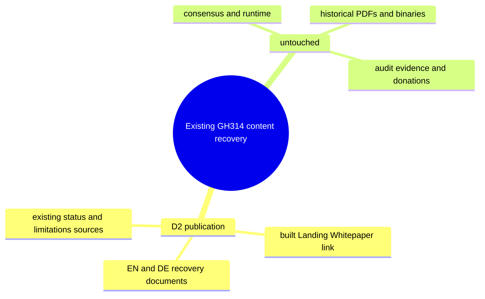

# GH314 — versioned content recovery boundary

Existing issue #314, TRR29-31/35; baseline ff63e9d. Documentation only. Intent and unchanged
limits: README.md, docs/status.json (production false), docs/LIMITATIONS.md. No V3/V4 runtime.

## Built publication hop D2

`docs/index.html::Resources/Whitepaper` links the maintained EN Markdown on GitHub.
EN/DE describe the same project, but historical vision exceeds repository evidence.
Recovery banners link existing status, limitations and rollout. They do not prove live
operators/networks, production ZKP, TSS, native vaults or financial results.
PoD follows wiki/operations/Validator-Guide.md (bought coins not categorically excluded).
DEX fees follow docs/developers/architecture/module-reference.md, not a new formula.

Allowed: both WhitePaper_TR Markdown files, only PoD sentence in index.html, narrow content
regressions in scripts/check-consistency.sh; append-only coordination separate. Untouched:
preserved #308/#313 corrections, runtime/keys/state/status figures/PDFs/binaries/donations.
Four-viewport visual gate covers changed PoD card. Full #314 stays open for inventory/history
and dependent corrections. No artifact deletion, runtime enforcement or rollout credit.
