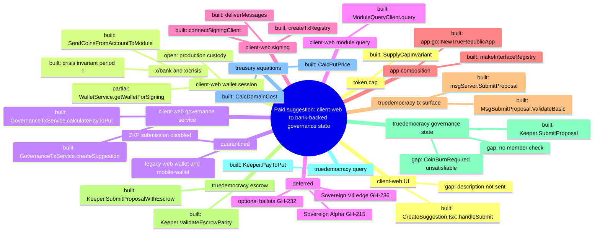

# TrueRepublic Architecture Map (GH-327)

**Scope:** one traced maintained user path — creating a paid suggestion in
`client-web` — from the browser into chain governance state and bank-backed
settlement. Every hop below was opened at the cited call site. Anything not
opened is marked `open`; it is not simulated.

**Accounting boundary:** this map is documentation only. It earns no rollout
credit and changes no code, dependency, protocol or public status. The
authoritative status stays in `docs/status.json` (`rollout.completed` 36 of
`rollout.total` 59, `rollout.production_ready: false`).

Diagram sources:

- `docs/architecture/map.puml` — mindmap and component diagram
- `docs/architecture/main-path.puml` — sequence diagram of the traced path

## 1. Ground idea

1. TrueRepublic is a Cosmos SDK chain for domain-based governance with a
   multi-asset DEX and CosmWasm — `docs/ARCHITECTURE.md` (System Overview);
   the PNYX cap is enforced by `token/invariant.go::SupplyCapInvariant`.
2. Members of a domain act by submitting issues/suggestions, placing stones and
   rating suggestions — `docs/ARCHITECTURE.md` (x/truedemocracy Key
   Components); the maintained client exposes suggestion creation and stones —
   `client-web/src/services/governanceTx.ts::GovernanceTxService`.
3. Submitting a suggestion costs a Pay-to-Put fee derived from the domain
   treasury and member count (whitepaper eq.3) —
   `treasury/keeper/rewards.go::CalcPutPrice`.
4. The fee is settled by moving real `upnyx` into the `truedemocracy` module
   account while the domain treasury claim grows by the same amount —
   `x/truedemocracy/escrow.go::SubmitProposalWithEscrow`.
5. Every block, `x/crisis` asserts module escrow parity and the PNYX supply cap
   — `x/truedemocracy/module.go::AppModule.RegisterInvariants`,
   `token/invariant.go::SupplyCapInvariant`, `app.go::NewTrueRepublicApp`.
6. `client-web` is the only maintained client — `CLAUDE.md` (Client policy),
   `AGENTS.md` (Stack and source of truth).
7. Boundary: recovery testnet only; not production-ready, no production
   custody, no production anonymous voting — `CLAUDE.md` (Production
   boundary), `docs/LIMITATIONS.md`, `docs/status.json`.

## 2. Traced path: create a paid suggestion

Route: `client-web/src/routes.tsx` maps
`/governance/domain/:domainId/issue/:issueId/create` to `CreateSuggestion`.

### 2a. Price quote (read)

| # | Hop | Datum over the edge |
| --- | --- | --- |
| Q1 | `client-web/src/components/governance/CreateSuggestion.tsx::CreateSuggestion (useEffect)` → `client-web/src/services/governanceTx.ts::GovernanceTxService.calculatePayToPut` | `domainId` route param used as domain name |
| Q2 | `governanceTx.ts::GovernanceTxService.calculatePayToPut` → `client-web/src/services/moduleQuery.ts::ModuleQueryClient.query` | path `/truedemocracy.Query/PayToPut`, field 1 = domain name |
| Q3 | `moduleQuery.ts::ModuleQueryClient.query` → CometBFT RPC `abci_query` → `x/truedemocracy/query_server.go::Keeper.PayToPut` | protobuf request bytes, `prove: false` |
| Q4 | `query_server.go::Keeper.PayToPut` → `treasury/keeper/rewards.go::CalcReward`, `CalcPutPrice` | domain treasury `upnyx` amount, member count |
| Q5 | `Keeper.PayToPut` → `GovernanceTxService.calculatePayToPut` → `CreateSuggestion` state | JSON `base_cost`, `domain_multiplier`, `final_cost`, `formula`; client rejects non-integer fields |

### 2b. Submit and settle (write)

| # | Hop | Datum over the edge |
| --- | --- | --- |
| W1 | `CreateSuggestion.tsx::handleSubmit` → `client-web/src/services/wallet.ts::WalletService.getWalletForSigning` | address + session password → session-bound `DirectSecp256k1HdWallet` |
| W2 | `CreateSuggestion.tsx::handleSubmit` → `governanceTx.ts::GovernanceTxService.createSuggestion` | domain, issue, title as suggestion name, fee `[{upnyx, final_cost}]`, empty external link |
| W3 | `GovernanceTxService.createSuggestion` → `client-web/src/services/signingClient.ts::connectSigningClient` | signer; checks bech32 prefix, 20-byte account, endpoint chain ID |
| W4 | `connectSigningClient` → `client-web/src/services/txRegistry.ts::createTxRegistry` | registry with `customRegistryTypes` including `/truedemocracy.MsgSubmitProposal` |
| W5 | `GovernanceTxService.createSuggestion` → `signingClient.ts::deliverMessages` | one `MsgSubmitProposal` EncodeObject (`sender` bytes, `creator` bech32, `fee`) |
| W6 | `deliverMessages` → CometBFT RPC (`simulate`, `signAndBroadcast`) → `app.go::NewTrueRepublicApp` baseapp `MsgServiceRouter` | signed tx; gas = simulation × `GAS_ADJUSTMENT` (2) |
| W7 | baseapp → `x/truedemocracy/signing.go::RegisterCustomGetSigners` (via `app.go::makeInterfaceRegistry`) and `x/truedemocracy/msgs.go::MsgSubmitProposal.ValidateBasic` | signer from `sender`; non-empty names; `creator == sender`; exactly one positive `upnyx` coin |
| W8 | router → `x/truedemocracy/msg_server.go::msgServer.SubmitProposal` (registered in `module.go::AppModule.RegisterServices`) | decoded `MsgSubmitProposal` |
| W9 | `msgServer.SubmitProposal` → `x/truedemocracy/escrow.go::Keeper.SubmitProposalWithEscrow` | sender, creator, names, fee, link |
| W10 | `SubmitProposalWithEscrow` → `x/truedemocracy/keeper.go::Keeper.SubmitProposal` (inside `CacheContext`) | same fields |
| W11 | `Keeper.SubmitProposal` → `treasury/keeper/rewards.go::CalcPutPrice`, `CalcDomainCost` | treasury amount, member count, fee amount |
| W12 | `Keeper.SubmitProposal` → KV store `domain:<name>` | `Domain` with `Treasury += fee` and appended `Suggestion` (issue auto-created if absent) |
| W13 | `SubmitProposalWithEscrow` → `x/bank` `SendCoinsFromAccountToModule` | fee from sender to `truedemocracy` module; `write()` only if both W10 and W13 succeed |
| W14 | `msgServer.SubmitProposal` → event manager | `submit_proposal` event with domain, issue, suggestion |
| W15 | `deliverMessages` → `CreateSuggestion` | `TransactionResult{hash, height, success}`; non-zero code throws raw log |
| W16 | EndBlock: `app.go` (`SetOrderEndBlockers`, crisis last) → `x/truedemocracy/escrow.go::Keeper.ValidateEscrowParity` and `token/invariant.go::SupplyCapInvariant` | module bank balance must equal treasury+stake claims; supply ≤ cap; crisis keeper invariant period 1 |

## 3. Modules

| Module | One responsibility | Entry | Status |
| --- | --- | --- | --- |
| client-web routing/UI | Collect domain, issue, title and show quote/result | `client-web/src/components/governance/CreateSuggestion.tsx::CreateSuggestion` | built |
| client-web wallet session | Produce a session-bound signer from the encrypted local test wallet | `client-web/src/services/wallet.ts::WalletService.getWalletForSigning` | partial (test wallet only; production custody open per `docs/LIMITATIONS.md`) |
| client-web governance service | Build governance messages and price queries | `client-web/src/services/governanceTx.ts::GovernanceTxService` | built |
| client-web module query | Fail-closed ABCI query transport and decoding | `client-web/src/services/moduleQuery.ts::ModuleQueryClient.query` | built |
| client-web signing | Chain-scoped signing client and single delivery path | `client-web/src/services/signingClient.ts::deliverMessages` | built |
| client-web tx registry | Fail-closed custom type URL set | `client-web/src/services/txRegistry.ts::createTxRegistry` | built |
| app composition | Wire keepers, routers, invariants and block order | `app.go::NewTrueRepublicApp` | built |
| truedemocracy tx surface | Decode, authenticate and route governance messages | `x/truedemocracy/msg_server.go::msgServer.SubmitProposal` | built |
| truedemocracy escrow | Atomically pair governance claims with bank custody | `x/truedemocracy/escrow.go::Keeper.SubmitProposalWithEscrow` | built |
| truedemocracy governance state | Apply proposal rules and persist the domain | `x/truedemocracy/keeper.go::Keeper.SubmitProposal` | built (see gaps G3, G4) |
| truedemocracy query | Serve the Pay-to-Put quote from the same equations | `x/truedemocracy/query_server.go::Keeper.PayToPut` | built |
| treasury equations | Deterministic reward/put-price equations | `treasury/keeper/rewards.go::CalcPutPrice` | built |
| x/bank (SDK) | Canonical coin custody | `SendCoinsFromAccountToModule` (Cosmos SDK) | built |
| token cap | Assert canonical supply ≤ 21,000,000,000,000 `upnyx` | `token/invariant.go::SupplyCapInvariant` | built |
| x/crisis (SDK) | Run registered invariants every block | `app.go` (`crisiskeeper.NewKeeper`, period 1) | built |
| client↔chain integration test | Opt-in delivery of every maintained tx family against a local node | `client-web/src/services/clientChain.integration.test.ts` | test-only (`TRUEREPUBLIC_CLIENT_CHAIN_INTEGRATION=1`) |
| Go path tests | Msg-server escrow boundary, quote/submit equality, wire vectors | `x/truedemocracy/msg_server_test.go::TestMsgServerSubmitProposalEscrowBoundary`, `query_merkle_paytoput_test.go::TestQueryPayToPutMatchesSubmitProposalCalculation`, `client_custom_tx_codec_test.go::TestClientCustomTxVectorsMatchGoWireEncoding` | test-only |
| client ZKP voting (neighbor) | Preview anonymous rating; submission disabled | `client-web/src/services/zkp.ts`, `client-web/src/components/zkp/VotingPanel.tsx` | quarantined |
| client custody envelope (GH-309) | One WebCrypto PBKDF2-SHA256/AES-GCM envelope with optional AAD for wallet and identity custody | `client-web/src/services/custodyEnvelope.ts::sealEnvelope`/`openEnvelope` | built (branch `agent/claude/GH309-custody-core`, draft PR #338) |
| client identity vault (GH-309) | Address-bound encrypted identity records under the exclusive vault Web Lock | `client-web/src/services/identityVault.ts::IdentityVault` | built, unwired (PR #338) |
| client legacy identity migration (GH-309) | Crash-safe move of the plaintext `identity-store` record into the vault | `client-web/src/services/identityMigration.ts::LegacyIdentityMigration` | partial (branch `agent/claude/GH309-migration-core`, unwired) |
| historical preview hash (GH-309, neighbor) | Pure, explicitly preview/mock FNV helper used to generate and to check legacy preview identities; never BN254-MiMC | to be extracted from `client-web/src/services/zkp.ts::ZKPService.mockMiMCHash` (GH309B2C1) | quarantined (preview only) |
| legacy clients | `web-wallet`, `mobile-wallet` prototypes | Git history only | quarantined |
| optional domain ballots (GH-231/GH-232) | Formal ballots with frozen policy/electorate | `docs/GOVERNANCE_BALLOT_ARCHITECTURE.md` | deferred |
| Sovereign V4 edge (GH-236) | Local-first edge layer around TRChain | `docs/SOVEREIGN_V4_EDGE_ARCHITECTURE.md`; unwired package `sovereignv4/protocol` | deferred (V4-0 code exists, no importer outside `sovereignv4/`) |
| Sovereign Alpha (GH-215) | Installable native client | `docs/SOVEREIGN_ALPHA_ARCHITECTURE.md` | deferred |
| suggestion lifecycle EndBlock (neighbor) | Zone transitions / auto-delete of stored suggestions | `docs/ARCHITECTURE.md` (EndBlock order) | open (not traced) |

## 4. Wiring (one sentence per edge)

- `CreateSuggestion` asks `GovernanceTxService.calculatePayToPut` for the current put price of the route's domain.
- `GovernanceTxService.calculatePayToPut` sends the domain name to `ModuleQueryClient.query` on `/truedemocracy.Query/PayToPut`.
- `ModuleQueryClient.query` posts a JSON-RPC `abci_query` to the configured RPC, which reaches `Keeper.PayToPut`.
- `Keeper.PayToPut` computes `CalcReward` and `CalcPutPrice` from the stored domain treasury and member count and returns JSON.
- `CreateSuggestion.handleSubmit` obtains a session-bound signer from `WalletService.getWalletForSigning`.
- `CreateSuggestion.handleSubmit` passes domain, issue, title and the quoted fee to `GovernanceTxService.createSuggestion`.
- `GovernanceTxService.createSuggestion` opens a client through `connectSigningClient`, which rejects foreign prefixes and chain IDs.
- `connectSigningClient` binds the client to `createTxRegistry`, which only admits the enumerated custom type URLs.
- `GovernanceTxService.createSuggestion` hands one `MsgSubmitProposal` to `deliverMessages`, which simulates, signs and broadcasts it.
- The baseapp extracts the signer via `RegisterCustomGetSigners` and runs `MsgSubmitProposal.ValidateBasic` before routing.
- The `MsgServiceRouter` dispatches to `msgServer.SubmitProposal`, registered by `AppModule.RegisterServices`.
- `msgServer.SubmitProposal` delegates to `Keeper.SubmitProposalWithEscrow`, which re-checks coin shape and the signer claim.
- `Keeper.SubmitProposalWithEscrow` calls `Keeper.SubmitProposal` inside a cache context.
- `Keeper.SubmitProposal` checks the fee against `CalcPutPrice` (and `CalcDomainCost` when `CoinBurnRequired`) and writes the domain with the new suggestion and increased treasury.
- `Keeper.SubmitProposalWithEscrow` moves the fee to the module account through `x/bank` and commits only if that transfer succeeds.
- `msgServer.SubmitProposal` emits a `submit_proposal` event after the escrowed commit.
- At EndBlock, `x/crisis` runs `ValidateEscrowParity` and `SupplyCapInvariant` after the custom modules.
- GH-309 custody neighbor: `LegacyIdentityMigration.migrate` accepts only the canonical legacy preview bytes, then checks with the historical preview hash that commitment = hash(secret) and nullifier = hash(secret + "00"); a mismatch classifies the record QUARANTINED without a vault write, otherwise it continues to `IdentityVault.runExclusive` and the custody envelope.

## 5. Contradictions and gaps

Recorded as found; no narrative is preferred.

- **C1 — "V3" naming.** The GH-327 brief speaks of a "V3 ballot". The active
  ballot architecture and roadmap do not use that product-version label; they
  call it the optional domain ballot (GH-231 design, GH-232 deferred implementation).
- **C2 — ballot status wording.** `docs/GOVERNANCE_BALLOT_ARCHITECTURE.md`
  says "implementation-ready proposal"; `docs/ROLLOUT_ROADMAP.md` (Delivery
  priority) and `AGENTS.md` say GH-232 stays deferred behind rollout gates.
- **C3 — ZKP described as a module feature vs. disabled.** `docs/ARCHITECTURE.md`
  lists "ZKP Voting" in the chain overview; `client-web/src/components/zkp/VotingPanel.tsx`
  renders "submission disabled" and `client-web/src/services/zkp.ts` uses a
  mock hash with no submittable path.
- **C4 — suggestion description.** `CreateSuggestion` collects a description,
  but `handleSubmit` sends only the title (as `suggestionName`) and an empty
  `externalLink`; the description never leaves the browser.
- **G1 — zero put price.** If `CalcPutPrice` returns 0 (treasury below `CEarn`
  or no members), the client sends a zero-amount fee, which
  `validatePNYXCoins` rejects; such domains cannot receive suggestions from
  `client-web`. Derived from code, not executed.
- **G2 — quote race and overpayment.** The fee is the quote at page load. If
  the treasury grows before inclusion, the chain rejects with "Fee below put
  price"; any fee above the price is credited in full to the treasury.
- **G3 — no membership check on this path.** `Keeper.SubmitProposal` checks
  only `OnlyAdminIssues`; no opened hop verifies that `creator` is a domain
  member.
- **G4 — `CoinBurnRequired` predicate.** The check
  `fee < CalcDomainCost(fee)` equals `fee < fee × CDom × CEarn` (2 × 1000), so
  any positive fee fails when the option is set; no burn is performed (the fee
  goes to treasury). No Go test references `CoinBurnRequired`, and no tx sets
  it; it is reachable only through stored/genesis domain options.
- **G5 — production custody.** The signer is a locally encrypted test wallet;
  hardware/extension custody and real funds are unqualified
  (`docs/LIMITATIONS.md`).
- **G6 — end-to-end evidence is opt-in.** The only browser-to-node proof of
  this path is `clientChain.integration.test.ts`, skipped unless its
  environment gate is set.
- **G7 — Bridge reading order.** `docs/agent-bridge/README.md` requires
  `PROJECT_STATE.md`, `TODO.md`, `SECURITY_NOTES.md`; their newest entries
  still describe GH-304 as in review, while `git log` shows it merged as #319.

## 6. Hard scope boundaries

| Track | In scope now | Status source |
| --- | --- | --- |
| Basic rollout (59-item tracker, GH-29) | yes — only this map's modules and their gaps | `docs/status.json` `rollout`, `docs/ROLLOUT_ROADMAP.md` |
| Optional domain ballots (brief: "V3"; GH-231/GH-232) | no — deferred, no consensus or client code | `docs/GOVERNANCE_BALLOT_ARCHITECTURE.md`, `AGENTS.md` |
| Sovereign V4 edge (GH-236, V4-1 wiring) | no — V4-0 stays unwired; V4-1 waits for Basic rollout | `docs/SOVEREIGN_V4_EDGE_ARCHITECTURE.md`, `docs/ROLLOUT_ROADMAP.md` |
| Sovereign Alpha (GH-215) | no — design only | `docs/SOVEREIGN_ALPHA_ARCHITECTURE.md` |
| Anonymous ZKP submission | no — quarantined until ceremony, prover and review | `docs/agent-bridge/SECURITY_NOTES.md` (GH-297) |

## 7. Mindmap (Mermaid)

## 8. Next allowed node and untouched files

**Next node:** `truedemocracy governance state`, hop **W11/W12**
(`x/truedemocracy/keeper.go::Keeper.SubmitProposal`). Candidate causes on the
map: G3 (membership) and G4 (`CoinBurnRequired`). Any change there needs its
own GitHub issue, an explicit high-risk consensus approval (`AGENTS.md`), and
may touch only `x/truedemocracy/keeper.go` plus its focused tests. Client gaps
C4/G1/G2 belong to the separate node `client-web routing/UI` (W2) and are not
part of the same diff.

**Must remain untouched by that change:** `x/truedemocracy/escrow.go`,
`x/truedemocracy/msg_server.go`, `x/truedemocracy/msgs.go`,
`treasury/keeper/rewards.go`, `token/`, `app.go`, `client-web/`,
`sovereignv4/`, `docs/GOVERNANCE_BALLOT_ARCHITECTURE.md`,
`docs/SOVEREIGN_V4_EDGE_ARCHITECTURE.md`, `docs/status.json`, `BRIDGE.md`,
`docs/agent-bridge/`.
